# 反向连接器
[English](README_EN.md) | [中文](README.md)

### 词汇反向助记软件
这是一个背单词程序，主要功能是依照艾宾浩斯记忆曲线特性，建立英文词汇的反向连接，即加强根据词汇的意思来回想原单词的能力；并且还需要有拼写之前拼错的单词的功能。

由于平时背单词总是正向背，即根据英文单词的意思来背中文释义，虽然快但是理解不牢固，并且经常根据语境（如见到词汇的中、英文释义）无法回想出对应的词汇具体是什么，也就**无法熟练运用这些词汇**。所以，为了能够熟练运用自己背过的单词，一个建立反向链接的背单词程序是有必要的。

- 词汇输入部分：
    -  方式：
        - 逐个输入：在从平常的背单词软件听写单词（也可以是词组）到输入框内提交。单词提交后系统后台自动通过一段爬虫代码爬取字典网页信息以导入数据库
           - 若爬取失败，通过GUI的文字展现出来提示，看是否拼错且需要加入重拼计划
           - 爬取成功，输出相应的提示
               - 如果是逐个输入（听写输入）看是否和自己正在背记的单词意思一致，然后加入对应计划
        - 批量（txt文件输入）：从一个单词表文件导入进数据库中，一次性导入许多单词。
    -  类型：
        - 单词：
            - 单词不熟悉，需要在未来一段时间反复复现，则加入重现计划
            - 单词拼写错误，需要在未来一段时间反复重拼，则加入重拼计划
            - 以上两者可以同时选择
        - 词组：词组不熟悉，需要在未来一段时间反复复现，加入重现计划
    
- 复习部分：
    - 每天将会根据数据库计划清单中的next_revise_date这一项（或者直接从封装好了的视图中）筛选出今天的复习任务
        - 重现（refresh）：先输出对应的词汇的中英释义（可切换），然后使用者回想原单词是什么，然后可以查看答案
            - 若认为熟悉，那么就可以把掌握程度加1（数据库触发器自动推算下一个复习日期）
            - 若认为不熟悉，则可以重置复现计划
        - 重拼（respell）：先输出对应的中文释义，然后可以选择性地输出音标，然后根据这些信息来在输入框拼写单词，然后后台验证正确性
          - 正确拼写，掌握程度加1
          - 拼写错误，可以选择重置拼写计划
    - 平时可以查看库中的全部计划以及今日计划的总览，好对整体的复习进度有一个了解


### 环境与库
- 数据库采用MySQL8，确保先搭建完成并且执行脚本glossary_db_establish.sql
- 采用python3.10
- 整个应用界面采用python库ttkbootstrap，是tkinter的升级版，需要通过pip install来下载
- 英文释义查询需要下载nltk库，也需要通过pip install来下载
- 查询中文释义时需要联网，并且**必须是大陆网络**，否则无法查询中文释义
- 在util/sqlhelper.py中换上自己数据库的连接信息
```shell
# 首先确保下载了MySQL8，python解释器为3.10
net start mysql
mysql -u username -p database_name < glossary_db_establish.sql
pip install ttkbootstrap
pip install nltk
python main.py
```
其中，username 是你的数据库用户名，database_name 是你要连接的数据库名称，script.sql 是你的 SQL 脚本文件名。

### 文件结构
- ./util/consultant.py
  - 负责词汇的查询，信息整理，包括中英释义音标例句等
- ./util/sqlhelper.py
  - 负责多数gui部分和MySQL数据库的交互接口，包括许多将查询得到的信息一并插入数据库的函数，以及多线程并行查询（文件导入）等
- ./input_window.py
  - 含有DictationWindow以及ImportFileWindow的类的具体实现
- ./revise_window.py
  - 含有RefreshWindow和RespellWindow两个类的实现  
- ./misc_window.py
  - MiscWindow部分的实现
- ./main.py
  - 主窗口部分以及主函数的实现

### 作品展示

- 听写(逐个输入)

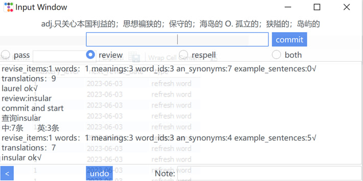
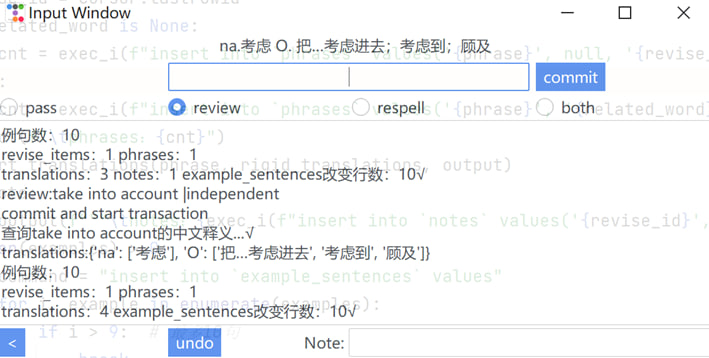

- 文件输入

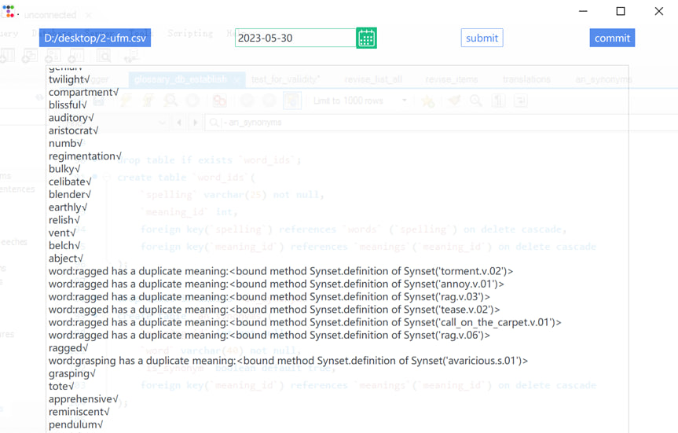
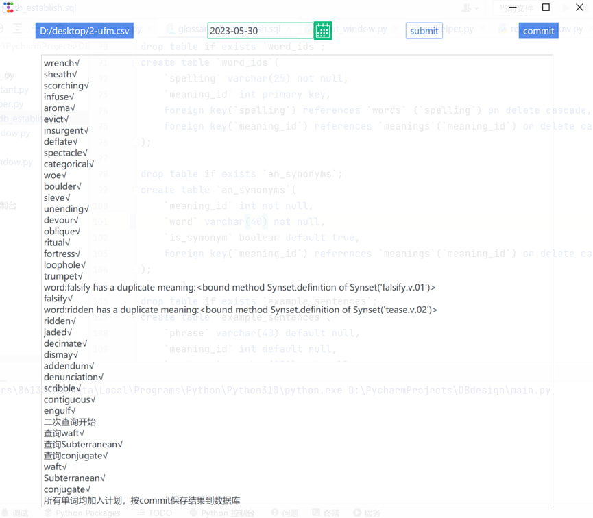

- refresh

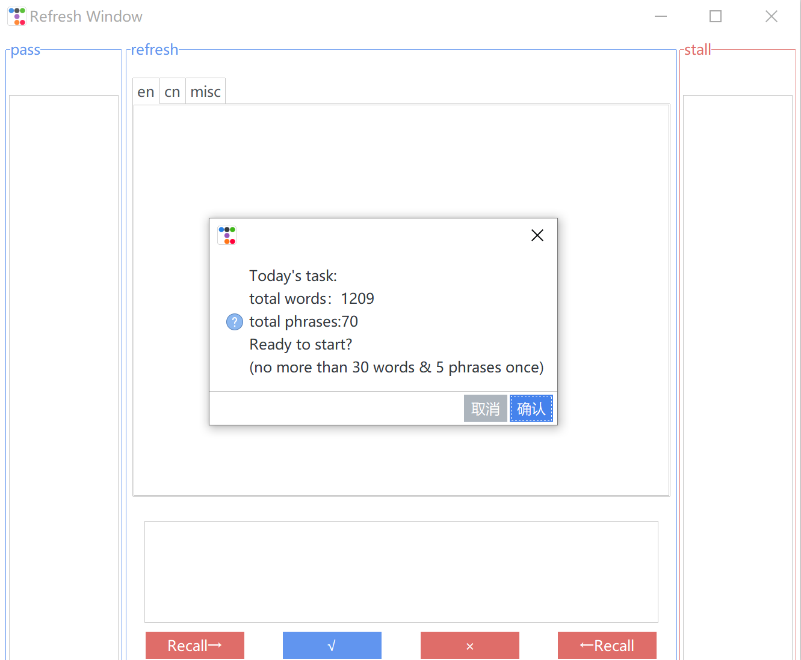
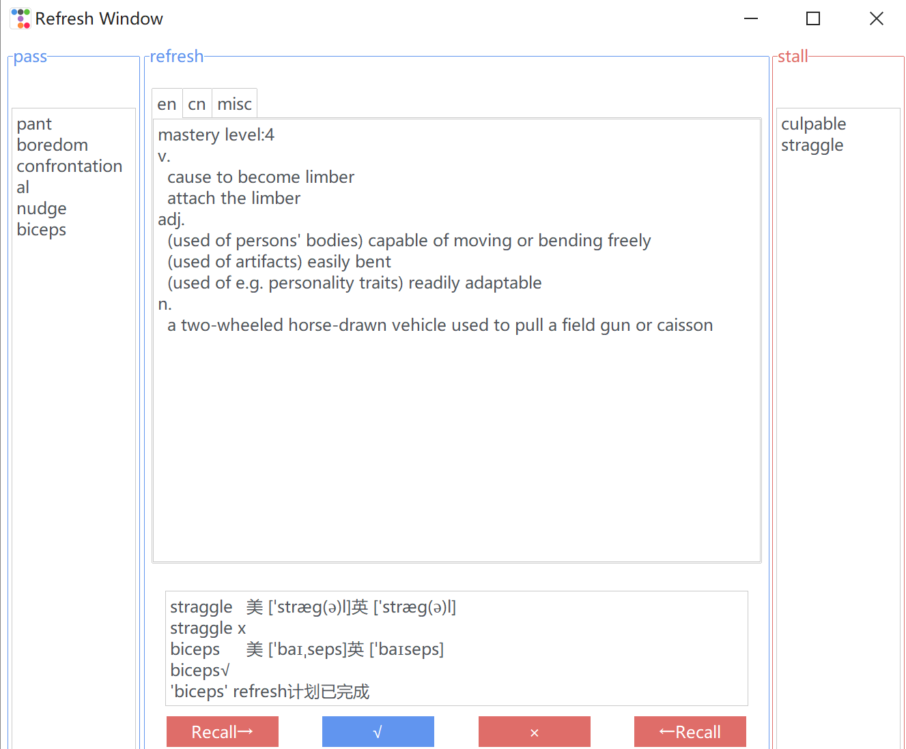
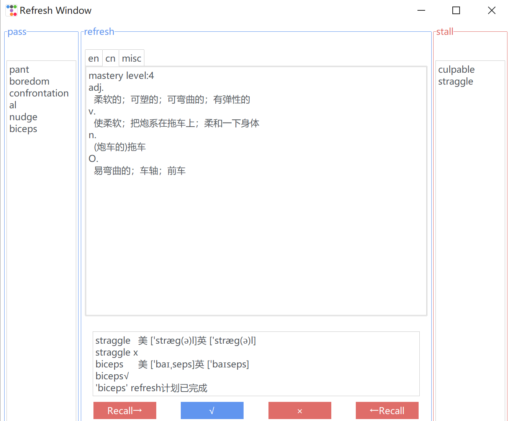
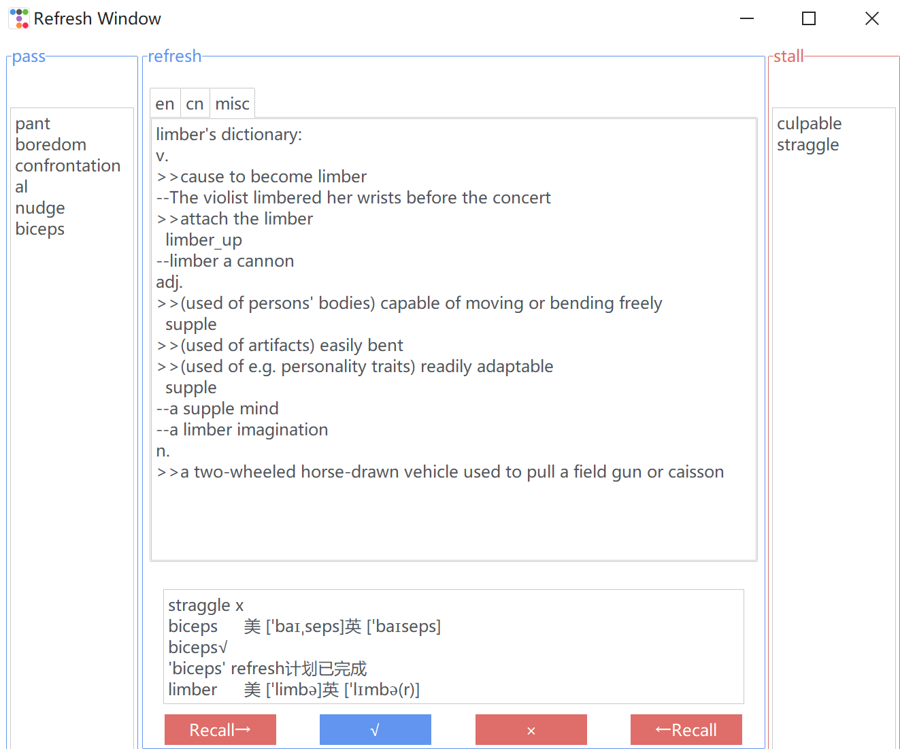
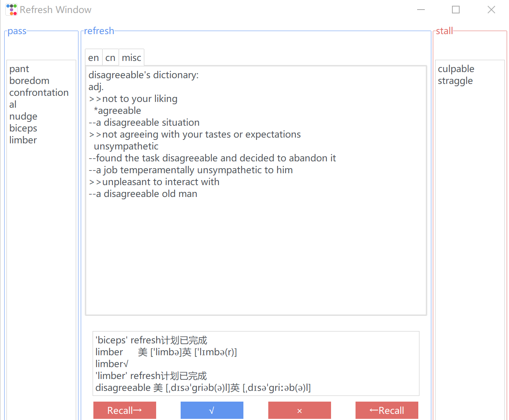
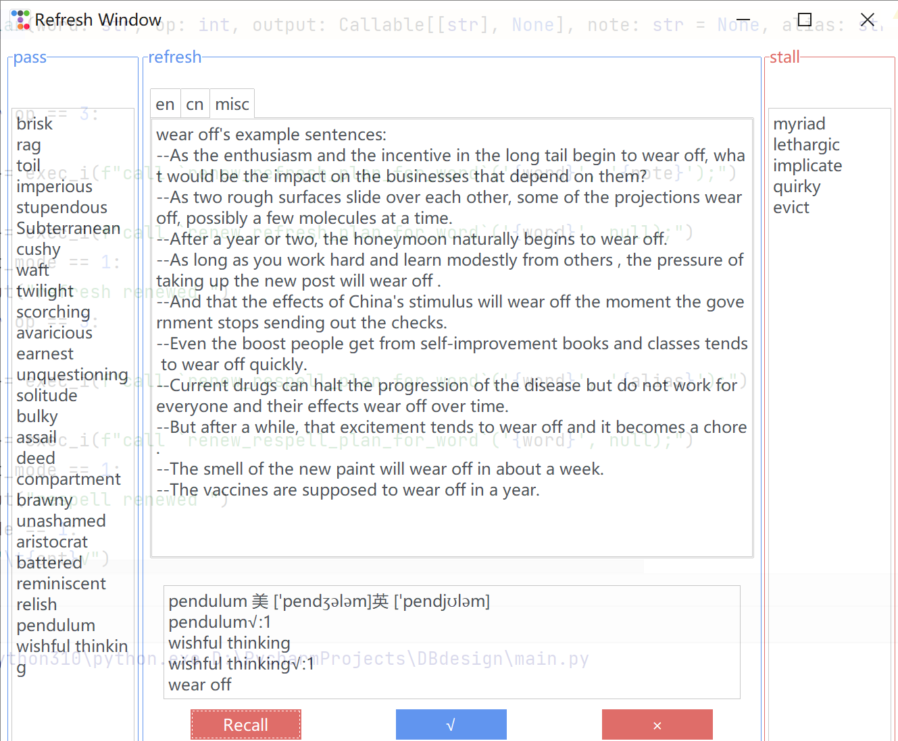

- respell

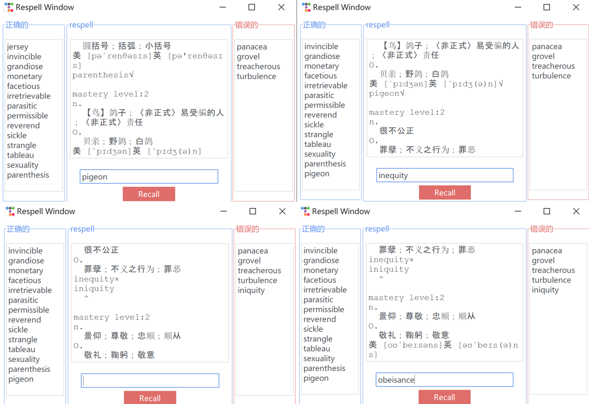

- misc

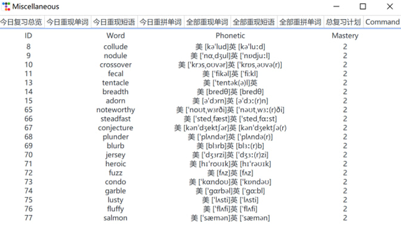