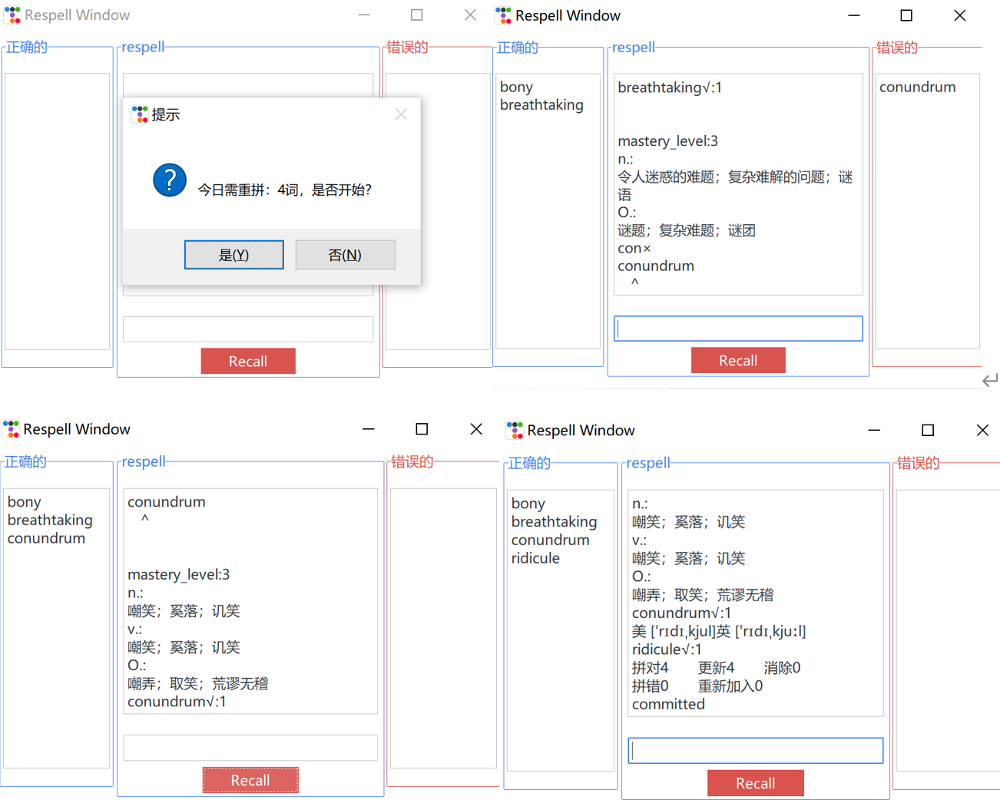

# DBdesign
Database course design: glossary with GUI using python, tkinter.

### 环境与库：
- 数据库采用MySQL8，确保先搭建完成并且执行脚本glossary_db_establish.sql
- 采用python解释器，并且是python3.10版本
- 整个应用界面采用python库ttkbootstrap，是tkinter的升级版，需要通过pip install来下载
- 英文释义查询需要下载nltk库，也需要通过pip install来下载
- 查询中文释义时需要联网，并且必须是国内网络，否则无法查询中文释义
- 在util/sqlhelper.py中换上自己电脑的连接信息

### 文件结构
- ./util/consultant.py      -------负责词汇的查询，信息整理，包括中英释义音标例句等
- ./util/sqlhelper.py        -------负责多数gui部分和MySQL数据库的交互接口，包括许多将查询得到的信息一并插入数据库的函数，以及多线程并行查询（文件导入）等
- ./input_window.py       -------含有DictationWindow以及ImportFileWindow的类的具体实现
- ./revise_window.py      -------含有RefreshWindow和RespellWindow两个类的实现  
- ./misc_window.py-------------MiscWindow部分的实现
- ./main.py----------------------主窗口部分以及主函数的实现

### 作品展示
- 听写

- 文件输入

- refresh

- respell

- misc
