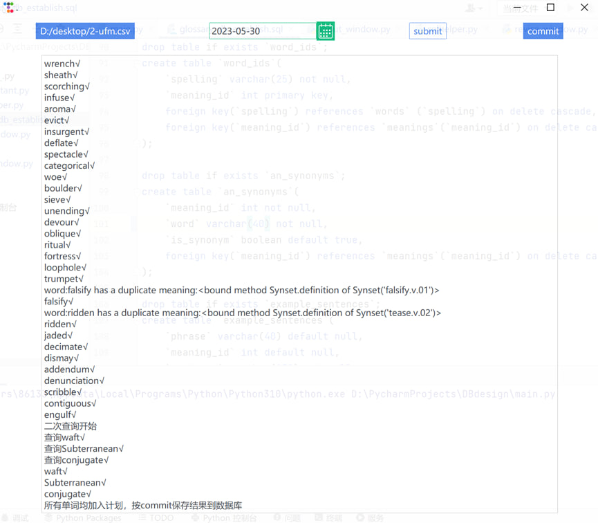
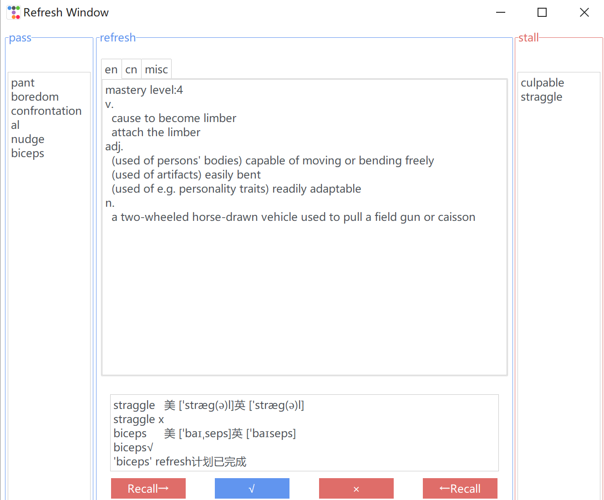
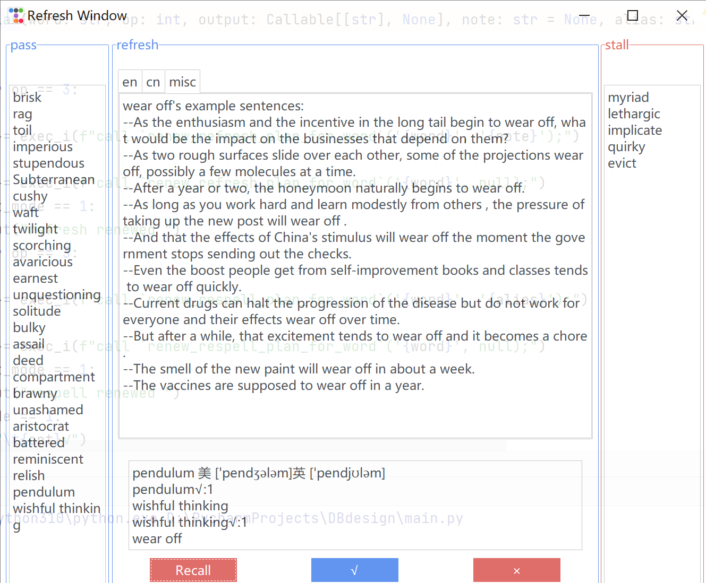
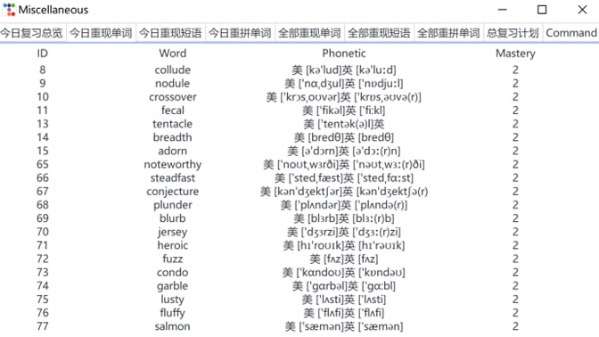

# Reverse linker
[English](README_EN.md) | [中文](README.md)

### Vocabulary Reverse Memorization Software
This is a vocabulary learning program that focuses on establishing reverse connections for English words based on the characteristics of the Ebbinghaus forgetting curve. It strengthens the ability to recall the original word based on the meaning of a vocabulary word. It also includes a feature to review words that were previously misspelled.

Since traditional vocabulary learning typically involves learning words in a forward manner, i.e., memorizing the Chinese meanings based on English words, it is fast but not effective for long-term retention. It is often difficult to recall the specific English word based on the context (such as seeing the Chinese or English definitions). Therefore, in order to proficiently use the vocabulary that has been learned, it is necessary to establish reverse connections.

- Vocabulary Input:
    - Methods:
        - Individual input: Users can input words (or phrases) one by one into the input box, similar to dictation. After submitting the word, the system automatically retrieves information from dictionary websites through web scraping and imports it into the database.
            - If the web scraping fails, a GUI prompt will be displayed to check for spelling errors and the need to add it to the relearning plan.
            - If the web scraping is successful, the corresponding prompt will be displayed.
                - For individual input (dictation input), check if the meaning matches the word currently being learned, and add it to the corresponding plan.
        - Batch input (from a txt file): Import a list of words from a file into the database in one go.
    - Types:
        - Single words:
            - If a word is unfamiliar and needs to be reviewed repeatedly in the future, add it to the review plan.
            - If a word is misspelled and needs to be reviewed repeatedly in the future, add it to the relearning plan.
            - Both options can be selected simultaneously.
        - Phrases: If a phrase is unfamiliar and needs to be reviewed repeatedly in the future, add it to the review plan.

- Review:
    - Each day, the program will filter out today's review tasks based on the `next_revise_date` field in the database plan list (or directly from pre-defined views).
        - Refresh: Display the corresponding Chinese and English definitions of the word (with the option to switch), and then the user tries to recall the original word before revealing the answer.
            - If the word is recognized as familiar, increase the mastery level by 1 (the database trigger automatically calculates the next review date).
            - If the word is not recognized as familiar, the user can reset the review plan.
        - Respelling: Display the corresponding Chinese definition, and optionally display the phonetic symbols. The user then tries to spell the word in the input box, and the correctness is verified in the background.
            - If the spelling is correct, increase the mastery level by 1.
            - If the spelling is incorrect, the user can choose to reset the spelling plan.
    - Users can also view an overview of all plans and today's plans to get an understanding of their overall progress.

### Environment and Libraries
- MySQL 8 is used as the database. Make sure it is set up and execute the `glossary_db_establish.sql` script.
- Python 3.10 is used.
- The entire application interface is built using the Python library `ttkbootstrap`, an upgraded version of `tkinter`. It needs to be downloaded using `pip install`.
- The `nltk` library is needed for English definition lookup. It also needs to be downloaded using `pip install`.
- Internet connection is required for Chinese definition lookup, and it must be a mainland China network in order to query Chinese definitions.
- Modify the database connection information in `util/sqlhelper.py`.
```shell
# Make sure MySQL 8 is installed and Python interpreter is 3.10
net start mysql
mysql -u username -p database_name < glossary_db_establish.sql
pip install ttkbootstrap
pip install nltk
python main.py
```
Replace `username` with your database username, `database_name` with the name of the database you want to connect to, and `script.sql` with the name of your SQL script file.

### File Structure
- ./util/consultant.py
  - Responsible for vocabulary lookup, information organization, including Chinese and English definitions, phonetic symbols, example sentences, etc.
- ./util/sqlhelper.py
  - Handles most of the GUI and MySQL database interactions, including functions to insert retrieved information into the database, as well as multi-threaded parallel queries (for file import), etc.
- ./input_window.py
  - Implementation of classes DictationWindow and ImportFileWindow.
- ./revise_window.py
  - Implementation of classes RefreshWindow and RespellWindow.
- ./misc_window.py
  - Implementation of MiscWindow.
- ./main.py
  - Implementation of the main window and main function.

### Showcase

- Dictation(one-by-one input)


- File input




- refresh







- respell


- misc

