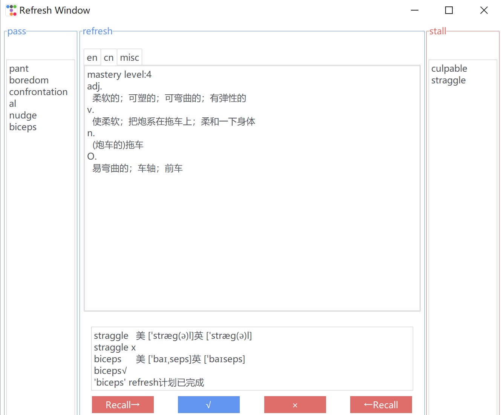
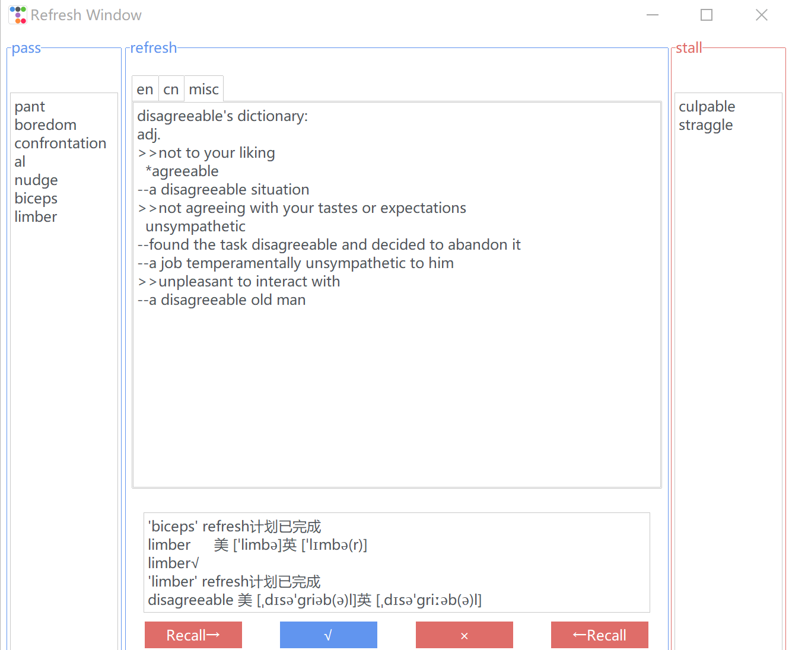
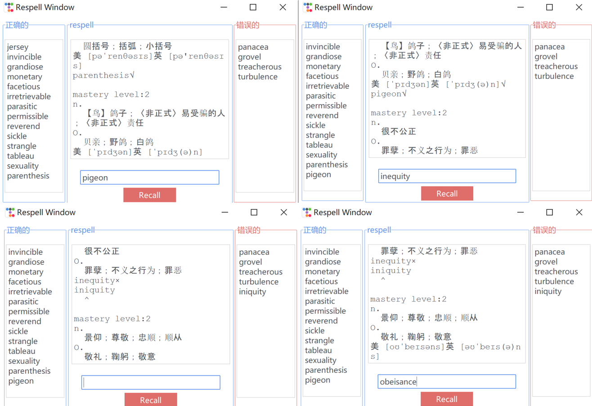

# Reverse Linker

### Reverse Linker: Vocabulary Reverse Memorization Software
This is a vocabulary learning software that focuses on strengthening the ability to recall English words based on their meanings, following the characteristics of the Ebbinghaus forgetting curve. It also includes a feature to review words that were previously misspelled.

Why "reverse"? Typically, when learning vocabulary, we memorize words based on their meanings in our native language, which is a forward approach. However, this method often leads to weak understanding and difficulty recalling the specific word when confronted with the context (such as seeing the word's definition in both languages). As a result, we are unable to proficiently use these words. To address this, it is necessary to establish a reverse connection in a vocabulary learning program.

The software consists of two main parts:

- Vocabulary Input:
    - Methods:
        - Individual Input: Manually enter words (or phrases) from a word learning software into the input box. The system will automatically scrape dictionary web pages using a web crawler and import the words into the database.
            - If scraping fails, an error message will be displayed in the GUI to check if there was a spelling mistake and if the word needs to be added to the respell plan.
            - If scraping is successful, a corresponding success message will be displayed.
                - For individual input (dictation input), check if the meaning matches the word currently being learned, and add it to the corresponding plan.
        - Batch Input (txt file): Import a list of words from a file into the database in one go.
    - Types:
        - Words:
            - If a word is unfamiliar and needs to be reviewed repeatedly in the future, it will be added to the refresh plan.
            - If a word is misspelled and needs to be reviewed repeatedly in the future, it will be added to the respell plan.
            - Both options can be selected simultaneously.
        - Phrases: Can only be added to the refresh plan.
    
- Review:
    - Each day, the software will select the review tasks for the day based on the next_revise_date field in the database's plan list (or directly from the encapsulated view).
        - Refresh: Display the word's meanings (switchable between English and Chinese) and prompt the user to recall the original word. The answer can be viewed after attempting to recall.
            - If the word is considered familiar, the mastery level can be increased by 1 (the database trigger will automatically calculate the next review date).
            - If the word is considered unfamiliar, the refresh plan can be reset.
        - Respell: Display the Chinese meaning and optionally the pronunciation guide, and prompt the user to spell the word in the input box. The correctness will be verified.
            - If the spelling is correct, the mastery level can be increased by 1.
            - If the spelling is incorrect, the respell plan can be reset.
    - Users can view an overview of all plans in the database and today's plan to get an understanding of their overall progress.
    - If a word's mastery level is originally 4 and needs to be increased by 1, reaching the set upper limit (adjustable), the refresh or respell plan for that word will be completed.

### Environment and Libraries
- MySQL 8 is used as the database. Make sure to set it up and execute the glossary_db_establish.sql script.
- Python 3.10 interpreter is required.
- The application interface uses the ttkbootstrap library, an upgraded version of tkinter, which needs to be downloaded via pip install.
- The nltk library is needed for English definition queries and should be downloaded via pip install.
- Chinese definition queries require an internet connection and **must be connected to the network in mainland China**; otherwise, Chinese definitions cannot be queried.
- **Make sure to replace the connection information for your own database in util/sqlhelper.py**.
```shell
# Make sure MySQL 8 is installed and Python interpreter is 3.10
net start mysql
mysql -u username -p database_name < glossary_db_establish.sql
pip install ttkbootstrap
pip install nltk
python main.py
```
Replace `username` with your database username, `database_name` with the name of the database you want to connect to, and `script.sql` with the name of your SQL script file.

### File Structure
- ./util/consultant.py
  - Responsible for vocabulary lookup, information organization, including Chinese and English definitions, phonetic symbols, example sentences, etc.
- ./util/sqlhelper.py
  - Handles most of the GUI and MySQL database interactions, including functions to insert retrieved information into the database, as well as multi-threaded parallel queries (for file import), etc.
- ./input_window.py
  - Implementation of classes DictationWindow and ImportFileWindow.
- ./revise_window.py
  - Implementation of classes RefreshWindow and RespellWindow.
- ./misc_window.py
  - Implementation of MiscWindow.
- ./main.py
  - Implementation of the main window and main function.

### Showcase

- Dictation(one-by-one input)


- File input


- refresh







- respell



- misc

